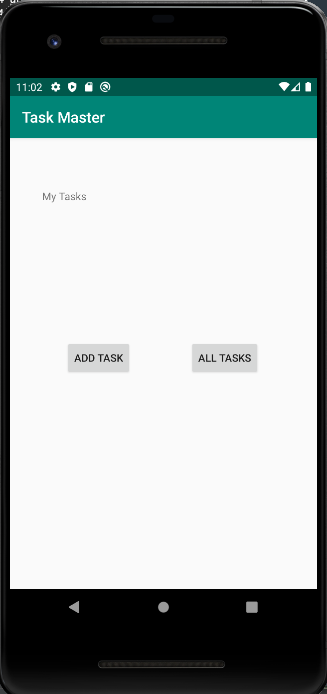
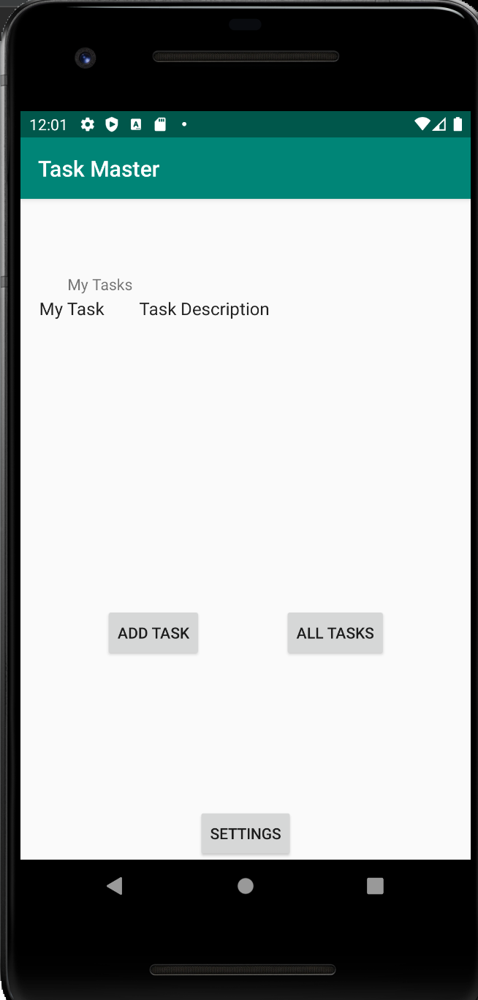
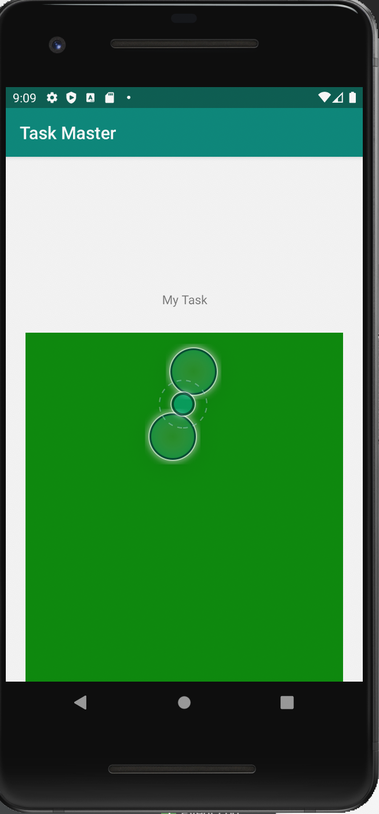

Day 1

This is my Task Master app day 1. So far, I have created a home page with two buttons that take you to an Add Task page or a All Tasks page. This is a screenshot of the home page:

The Add Task page allows you to add a task with a title and a description. When the Add Task button is clicked, you create an instance of a task with that title and description. I have written unit tests for the task class.

The All Tasks page is just a simple Android activity with a small image per the instructions.

Day 2

The Taskmaster app now has a settings button on the home page where the user can enter and save their username and it will be saved in Shared Preferences.

There are also 3 hard coded task's on the home page now and when you click the title of that task will be displayed in the task detail activity as shown below.

Day ??

Days later, I have finally figured out how to get this working. The app now displays a recycler view and you can click through to the task detail page via the recycler view.

Day 10

The room database has now been implemented. A user can add a task on the 'Add Task' activity by clicking the Add Task button on the Main Activity. The task will be saved to the database and then be visible on the Main Activity after the app restarts.

Day 10.01

There is now a second recycler view on the All Tasks activity. On click it displays the discription as a toast.

Day 12

I was able to add Amplify to the applicationa and you can now add tasks to the DynamoDB.

Day 14

Cognito is now set up with the ability to log in, log out, and the username is displayed in the main activity.

Day ??

S3 finally works! You can pick an image from your phone and upload it.

Final day:

Notifications have been added to the app. I did not use Lambda, because I'm rushing to get these last labs turned in and I'm okay with losing 2 points for not having Lambda.
Our class did not add teams to our app.

I added an intent filter to the app. You can now share images with Task Master and it will open the Add Task activity and the image will be ready to upload with a new task.

